# Managing-Dates-Relationships-Ans-Understanding-Join-In-PostgreSQL

GitHub Link: https://github.com/Apollo-Level2-Web-Dev/dbms-postgres

## 9-1 Handling Date and Date Functions in PostgreSQL

#### `Timezone`

- we can see our timezone

```sql
SHOW timezone
```

#### `Timestamp`

- Timestamp means combination of date,time and time zone.

- timestamp is two type

  1. timestamp with timezone

  2. timestamp without timezone

```sql

  CREATE TABLE timeZ(
  ts TIMESTAMP without time zone,
  tsz TIMESTAMP with time zone
  )

  INSERT INTO timeZ VALUES('2024-01-12 10:45:00', '2024-01-12 10:45:00')

  SELECT * FROM timeZ
```


```sql
SELECT now();
```


- `SELECT now()` Gives us gives us timestamp with time zone.

- now we want to see just `date`

```sql
SELECT CURRENT_DATE
```


- we can also see just the date using `SELECT now()`

```sql
SELECT now()::date;
```

- this is called casting.
- we can also do the casting with time as well and just see the time

```sql
SELECT now()::time;
```

#### converting timestamp format using `to_char(timestamp,text)`

- This takes timestamp and converts to a required text mentioned

```sql
SELECT to_char(now(), 'yyyy/mm/dd')
```

```sql
SELECT to_char(now(), 'dd/yyyy/mm');
SELECT to_char(now(), 'month');
SELECT to_char(now(), 'dd');
```

https://www.postgresql.org/docs/current/functions-formatting.html

- we can format any type following the documentation

#### `Interval` with dates

- we want to see the date of last year from todays date

```sql
SELECT CURRENT_DATE - INTERVAL '1 year'
```

- we see 1 month previous date from todays date

```sql
SELECT CURRENT_DATE - INTERVAL '1 month'
```

- we can play more around

```sql
SELECT CURRENT_DATE - INTERVAL '1 year 2 month'
```

#### `age()` with dates

- suppose we have date now we want to calculate the age using `age()`.

```sql
SELECT age(CURRENT_DATE,'1997-07-02')
```

- If we have date of birth we can easily find the age

```sql
SELECT * , age(CURRENT_DATE,dob) from students;
```

#### `Extract()` function usage

- using this we can extract month, day year etc from a date

```sql
SELECT extract(year from '2025-01-25'::date);
SELECT extract(month from '2025-01-25'::date);
SELECT extract(day from '2025-01-25'::date);
```

- ::date Convert the value on the left (in this case, the string '2025-01-25') into the date data type.

#### Lets discuss about `casting`

- sone using `::`

```sql
SELECT '0' :: BOOLEAN
```

- its similar like type casting like nwe are telling `0` will be boolean type. the casting must be logical.

## 9-2 Grouping and Filtering Data with GROUP BY and HAVING

#### `GROUP BY` Usage

- `aggregate` function is used basically with `group by` clause
- `group by` dose something like we have a lot of data and now we want to do grouping country wise. iF we want to do group by using blood group we can do this.

```sql
SELECT * FROM students
GROUP BY country;
```


- this is showing error because we are telling to show all the rows using `*`
- so the proper way of grouping is

```sql

SELECT country FROM students
GROUP BY country;
```


```sql
SELECT country,age FROM students
GROUP BY country;
```


- This also shows the error, since age must be in group by or we have to use aggregate function.
- this is happening age is not relevant to the country groups , does not understand whose age should be shown,

- if we want to see how many students are in each country we acn see that.

```sql
SELECT country, count(*) FROM students
GROUP BY country;
```


- here `count(*)` is acting differently. rather than counting all the students together its counting each grouped countries students and showing.

- this happening because group by works in split,apply and combine procedure when we use `aggregate ` function with `group by`.


- now lets see country wise students average age with the country wise student count.

```sql
SELECT country, count(*), avg(age) from students
GROUP BY country;
```


#### `HAVING` Usage

- using `having` we can filter data made by `group by`
- lets think of like we have grouped using country and saw the average age based on the students of each country, now we want to set a condition like which group has average age greater than 22 show me. `filter groups using having to show only countries with average age above 22`

```sql
SELECT country, avg(age) FROM  students
GROUP BY country
HAVING avg(age) > 22;
```

- here `where` Condition will not workout since where works row by row.
- Lets solve this `Count Students Born In Each Year`

```sql
SELECT extract(year from dob) as birth_year, count(*)
FROM students
GROUP BY birth_year;
```

## 9-3 Constructing Relationships with Foreign Key Constraints

- `Foreign Key` Is Important to make relationship between different tables.


- `primary key` is used to identifying a data uniquely
- `Foreign Key` also uniquely identify a row uniquely but other table from where it came.


- we are defining `user_id INTEGER REFERENCES user(id)`.

- now tels do something like `retrieve all posts for user with id 4`

```sql
SELECT * FROM Post
where user_id = 4;
```

- this is ok but we want to see the `title` of post table and the `username` which is in user table.

- lets create the tables

```sql
CREATE TABLE "user" (
    id serial PRIMARY KEY,
    username VARCHAR(25) NOT NULL
)

CREATE TABLE post (
    id serial PRIMARY KEY,
    title TEXT NOT NULL,
    user_id INTEGER REFERENCES "user" (id) NOT Null
)

```

## 9-4 Enforcing Referential Integrity: Behaviors During Data Insertion

- lets see the data we have inserted

```sql

-- Insert users
INSERT INTO "user" (username) VALUES
('alice'),
('bob'),
('charlie'),
('diana');

-- Insert posts
INSERT INTO
    post (title, user_id)
VALUES ('Alice first post', 1),
    ('Bob travel blog', 2),
    ('Charlie on coding', 3),
    ('Alice second post', 1),
    ('Diana book review', 4),
    (
        'Another tech tip from Bob',
        2
    );

SELECT * from "user";
SELECT * from post;
```

- during the insert of data who has dependency with foreign key, we have to make sure that the foreign key should exist in where it is coming from. I we do not do there will be no data integrity. validation is done so this will show error.

#### During the insertion there can be many cases.

1. attempting to insert a post with a user id that does not exist. this will show error of foreign key violation

```sql
INSERT INTO post (title, user_id) VALUES
('Alice  first post', 100)
```

2. Inserting a post with a valid user id

```sql
INSERT INTO post (title, user_id) VALUES
('Alice  first post', 1)
```

3. Attempting to insert a post without specifying a user id.

```sql
INSERT INTO post (title, user_id) VALUES
('Alice  first post', null)
```

- this is not a good thing, we have to prevent this using constrain `not null`

```sql
ALTER table post
alter column user_id set NOT Null;
```

#### Lets See the behavior while deleting foreign key related table.

- suppose we want to delete the user but the post is having the deleted users user id. this is happening data inconsistency and data integrity is not maintained.
- these default behavior we can control if we want. like if we delete a user the post of the user will be also deleted. or we can say something like if the user is deleted the post's user id will become null. or we can do something like if user is deleted we can set default value to the post user_id. or we can say something like the posts should be deleted before the deletion of the user.

## 9-5 Enforcing Referential Integrity: Behaviors During Data Deletion

#### Behaviors During Data Deletion

1. Cascading deletion --> `ON DELETE CASCADE` : When user is deleted delete the user posts as well.

```sql
CREATE TABLE post (
    id serial PRIMARY KEY,
    title TEXT NOT NULL,
    user_id INTEGER REFERENCES "user" (id) ON DELETE CASCADE
)
```

2. Setting Null --> `ON DELETE SET NULL` : When user is deleted SET THE POSTS USER_ID `NULL`

```sql
CREATE TABLE post (
    id serial PRIMARY KEY,
    title TEXT NOT NULL,
    user_id INTEGER REFERENCES "user" (id) ON DELETE SET NULL
)
```

3. Restrict Deletion --> `ON DELETE RESTRICT` / `ON DELETE NO ACTION` (default) : After the deletion of the posts of the user, then user will be deletable. basically we will not do it.

```sql
DELETE from "user"
WHERE id = 4;
```

```sql
CREATE TABLE post (
    id serial PRIMARY KEY,
    title TEXT NOT NULL,
    user_id INTEGER REFERENCES "user" (id) ON DELETE RESTRICT
)
```

1. set Default Value --> `ON DELETE SET DEFAULT` : Will set a default value in the user_id of the post which user has been deleted. this is not also practical.

```sql
CREATE TABLE post (
    id serial PRIMARY KEY,
    title TEXT NOT NULL,
    user_id INTEGER REFERENCES "user"(id) ON DELETE SET DEFAULT  DEFAULT 2
)
```

## 9-6 Joining Tables with Inner Join


#### Now lets retrieve all posts title with their user name using `Join`.

```sql
SELECT title, username FROM post;
```

- we can not do this since post table is not holding the username data, its just holding users foreign keys.

- the post table do not con tain `username` as well user table do not contain the `title`
- we can see both using `Join`. we can Do joining using foreign key.

```sql
SELECT title, username FROM post
JOIN "user" ON post.user_id = "user".id
```

- because of doing joining user and post(primary table) table has been combined.
- first keeps the primary table values
- then according to the primary tables user id finds the username and keep beside the user id of the primary table
- finally gives us what we need.


#### I we want to see all the data with the user name

```sql
SELECT * from post
JOIN "user" ON post.user_id = "user".id
```

#### lets learn about context

- After doing join we have got a combined table. here we have 2 `id`. id of user and if of post.
- if we want to see the id this will show us error saying `column reference "id" is ambiguous`.

```sql
SELECT id FROM post
JOIN "user" ON post.user_id = "user".id
```

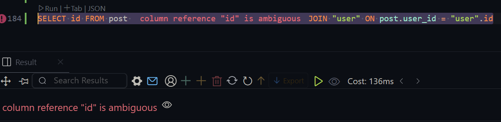

- we have to manage it by providing `context` that the which tables id should he show.

```sql
SELECT post.id FROM post JOIN "user" ON post.user_id = "user".id;
SELECT "user".id FROM post JOIN "user" ON post.user_id = "user".id;
```

- we are setting context that whose id it will be.
- where the table names are lengthy we can do aliasing.

```sql
SELECT p.id FROM post p
JOIN "user" u ON p.user_id = u.id;

-- we will use as as well.
SELECT * FROM post as p
JOIN "user" as u ON p.user_id = u.id;
```

- the `title` and `username` showing is said `inner join`


- whatever we have done we can say `INNER JOIN` Instead Of `JOIN`

```sql
SELECT id FROM post
INNER JOIN "user" ON post.user_id = "user".id
```

## 9-7 Understanding Left and Right Joins

```sql
SELECT * FROM post
INNER JOIN "user" ON post.user_id = "user".id;
```

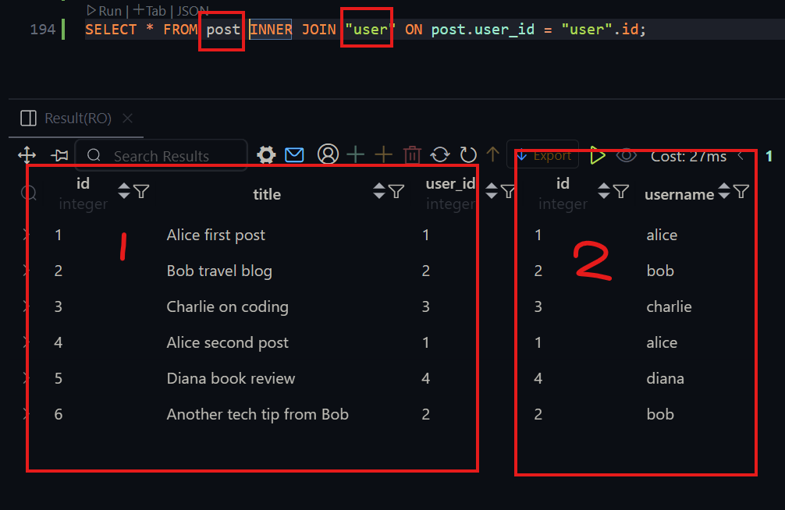

```sql
SELECT * FROM "user"
INNER JOIN post ON post.user_id = "user".id;
```

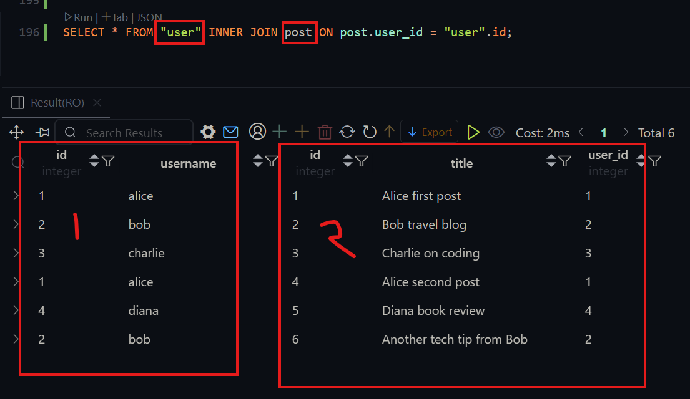

- here swapping the place of post and user is not impacting just changing the table column position.
- This order do not matter now but when the order will be an issue and then based on the situation two type of joining is required

  1. Left Join
  2. Right Join

- suppose we want to add a post whose user_id will be `null` the order will be issue then.

```sql
INSERT INTO post (title, user_id) VALUES ('Alice first post', NULL);
```

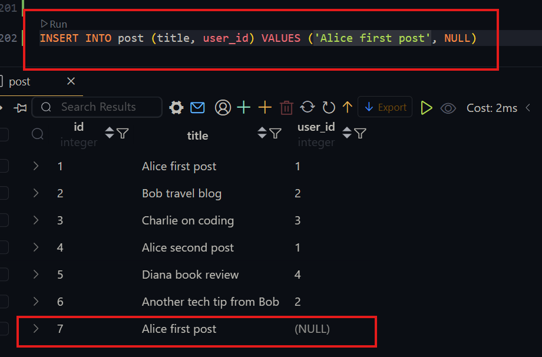

```sql
SELECT * FROM post INNER JOIN "user" ON post.user_id = "user".id;
```

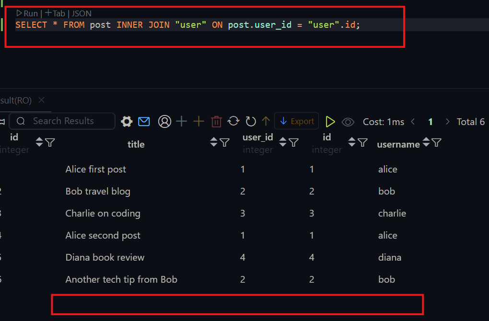

- we can see twh post whose user_id was `null` is not coming after doing the `inner join`.

##### so why this is happening?

- In the combined table while doing the inner join there only the values kept which matches the condition is given `post.user_id = "user".id`.
- In case of `null` user_id it could not match with any id of the `user` table so it did not sow in the combined table.
- same goes to id who have not posted their name is not kept.
- Basically it filter outs the things those do not met the condition


#### `LEFT JOIN` Usage

- suppose we want the thing like even if the user_id is `null` we want to see the post
- this might happen when its not a post of a user its the post of a company.
- In this situation we have to use `LEFT JOIN`


- so what is left table? the table we have wrote first. marked in teh picture.
  

- while doing the `LEFT JOIN` we have to keep all the data of left table.
- As its a combined table then it will fill the not found columns with `NULL`


```sql
SELECT * FROM post
LEFT JOIN "user" ON post.user_id = "user".id;
```

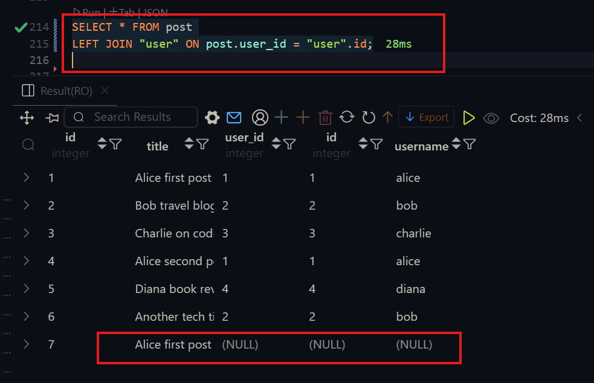

#### `RIGHT JOIN` Usage


- In case of Right join Right table will get priority.
- All data of right table will be kept, which data is not found in left table will be ste null.


```sql
SELECT * FROM post
right JOIN "user" ON post.user_id = "user".id;
```

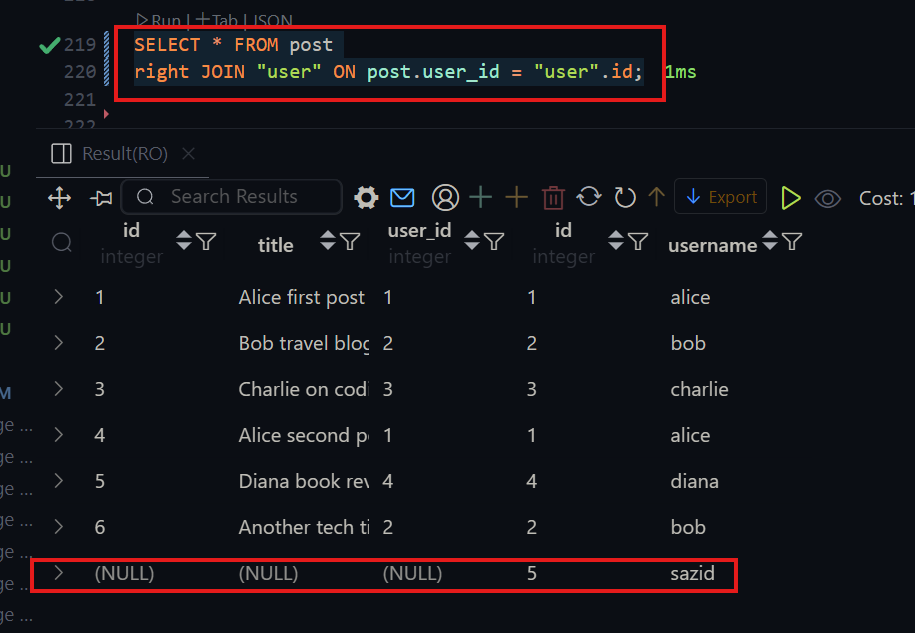

- In case of `LEFT JOIN` and `RIGHT JOIN` Order matters.
- we can tell `LEFT JOIN` and `RIGHT JOIN` like `LEFT OUTER JOIN` and `RIGHT OUTER JOIN`. both are same

```sql
SELECT * FROM post
LEFT OUTER JOIN "user" ON post.user_id = "user".id;

SELECT * FROM post
right outer JOIN "user" ON post.user_id = "user".id;
```

## 9-8 Exploring Full, Cross, and Natural Joins

#### `FULL JOIN` Usage

- `FULL JOIN` Means we have to keep all the data weather the condition is met or not.
- Where the condition is not met, its filled with null.


```sql
SELECT * FROM post
FULL OUTER JOIN "user" on post.user_id = "user".id
```

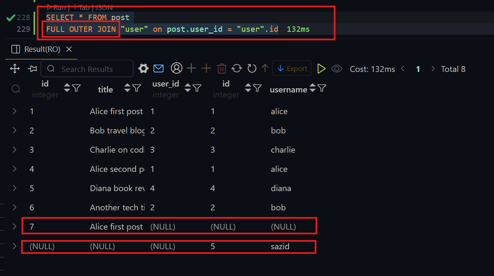

- lets summarize the joins


- there are some `join` except those.

- lets insert the data first

```sql
CREATE TABLE employees(
    emp_id INT,
    emp_name VARCHAR(50),
    dept_id INT
);

CREATE TABLE departments(
    dept_id INT,
    dept_name VARCHAR(50)
);

DROP table employees

INSERT INTO employees VALUES(1,'John Doe', 101);
INSERT INTO employees VALUES(2,'Jane Smith', 102);

INSERT INTO departments VALUES( 102,'Marketing');
INSERT INTO departments VALUES( 101,'Human Resources');

SELECT * FROM employees;

SELECT * FROM departments;
```

#### `Cross Join` Usage

- A Cross Join (also called a Cartesian Join) is a type of SQL join that returns every combination of rows from two tables.
- here we do not need to tell condition


```sql
SELECT * FROM employees
CROSS JOIN departments;
```

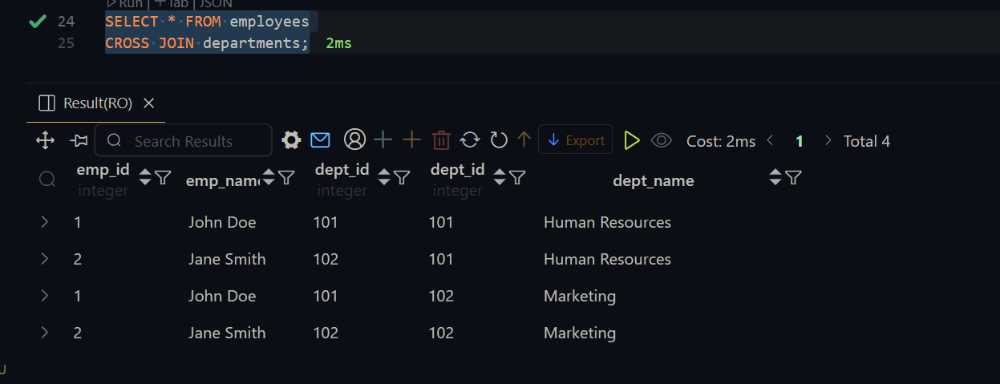

#### `NATURAL JOIN` Usage

- A NATURAL JOIN is a type of SQL join that automatically joins tables based on columns with the same names and compatible data types in both tables.
- while doing the `natural join` we need a common column in both table.
- In postgres if there is no common column between two table it will do `cross join` instead of `Natural Join`

##### so? how does the `natural join` works?

- first of all it does the `cross join` and then the common columns values which are equal are kept others are filtered.

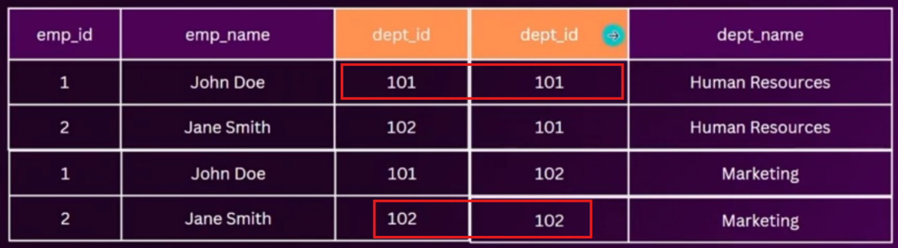


- after doing filtering it keep one column among the common column and then the column is shifted to the first column of the table.
  

```sql
SELECT * FROM employees
NATURAL JOIN departments;
```

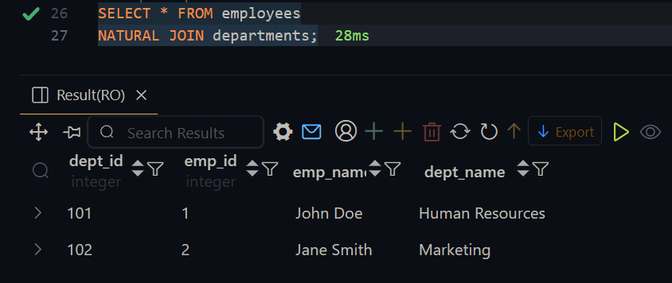

## Practicing WITH SQL

```SQL
CREATE TABLE employees(
    employee_id SERIAL PRIMARY KEY,
    employee_name VARCHAR(50),
    department_id INTEGER REFERENCES departments(department_id),
    salary DECIMAL(10,2),
    hire_date DATE
)

CREATE TABLE departments (
    department_id SERIAL PRIMARY KEY,
    department_name VARCHAR(50)
);

-- Inserting sample data into the departments table
INSERT INTO departments (department_name) VALUES
    ('HR'),
    ('Marketing'),
    ('Finance'),
    ('IT'),
    ('Sales'),
    ('Engineering'),
    ('Customer Support'),
    ('Administration'),
    ('Research'),
    ('Quality Assurance');

-- Inserting sample data into the employees table with a foreign key constraint
INSERT INTO employees (employee_name, department_id, salary, hire_date) VALUES
    ('John Doe', 1, 60000.00, '2022-01-10'),
    ('Jane Smith', 2, 75000.50, '2021-05-22'),
    ('Bob Johnson', 3, 80000.75, '2020-11-15'),
    ('Alice Williams', 4, 90000.25, '2019-08-03'),
    ('David Lee', 5, 65000.50, '2020-03-18'),
    ('Sara Brown', 6, 70000.00, '2021-09-28'),
    ('Mike Miller', 7, 55000.75, '2022-02-05'),
    ('Emily Davis', 8, 95000.00, '2018-12-12'),
    ('Chris Wilson', 9, 72000.50, '2020-06-30'),
    ('Amy White', 10, 68000.25, '2021-11-09'),
    ('John Johnson', 1, 62000.00, '2022-01-15'),
    ('Jessica Thompson', 2, 78000.50, '2021-06-05'),
    ('Michael Harris', 3, 85000.75, '2020-11-25'),
    ('Emma Martinez', 4, 92000.25, '2019-09-15'),
    ('James Taylor', 5, 67000.50, '2020-04-08'),
    ('Sophia Anderson', 6, 72000.00, '2021-10-10'),
    ('William Jackson', 7, 56000.75, '2022-02-10'),
    ('Olivia Nelson', 8, 97000.00, '2018-12-20'),
    ('Daniel White', 9, 73000.50, '2020-07-05'),
    ('Ava Wilson', 10, 69000.25, '2021-11-15'),
    ('Matthew Brown', 1, 63000.00, '2022-01-20'),
    ('Emily Garcia', 2, 76000.50, '2021-06-15'),
    ('Christopher Allen', 3, 86000.75, '2020-12-05'),
    ('Madison Hall', 4, 93000.25, '2019-09-25'),
    ('Andrew Cook', 5, 68000.50, '2020-04-18'),
    ('Abigail Torres', 6, 73000.00, '2021-10-20'),
    ('Ethan Murphy', 7, 57000.75, '2022-02-15'),
    ('Ella King', 8, 98000.00, '2018-12-28'),
    ('Nathan Rivera', 9, 74000.50, '2020-07-15'),
    ('Mia Roberts', 10, 70000.25, '2021-11-20');

SELECT * FROM employees;

SELECT * FROM departments;
```

1. **Inner Join to Retrieve Employee and Department Information**

```SQL
SELECT * FROM employees
INNER JOIN departments ON employees.department_id = departments.department_id;
```

- This joining we have do multiple time so, if any table contains same column name like here two `department_id ` is available. we can use a short syntax named `USING`

```sql
SELECT * FROM employees
INNER JOIN departments USING(department_id);
```

2. **Group By Department with Average Salary**

```SQL
SELECT department_name, round(avg(salary)) as avg_salary FROM employees
INNER JOIN departments USING(department_id)
GROUP BY department_name;
```

3. **Count Employees in Each Department**

```sql
SELECT department_name, count(*) as employee_count FROM employees
INNER JOIN departments USING(department_id)
GROUP BY department_name;
```

4. **Find the Department name with the Highest Average Salary**

```sql
SELECT department_name, round(avg(salary)) as avg_salary FROM employees
INNER JOIN departments USING(department_id)
GROUP BY department_name
ORDER BY avg_salary DESC
LIMIT 1;
```

5. **Count Employees Hired Each Year**

```sql
SELECT extract(year from hire_date) as hired_years, count(*) FROM employees

GROUP BY hired_years;
```

6. **Find customers who have placed more than 2 orders and calculate the total amount spent by each of these customers.**

```sql
CREATE TABLE orders(
    order_id SERIAL PRIMARY KEY,
    customer_id INT,
    order_date DATE,
    total_amount DECIMAL(10,2)
)


INSERT INTO orders (customer_id, order_date, total_amount) VALUES
(101, '2025-05-01', 199.99),
(102, '2025-05-02', 89.50),
(103, '2025-05-03', 145.00),
(104, '2025-05-04', 320.75),
(101, '2025-05-05', 25.99),
(105, '2025-05-06', 470.00),
(102, '2025-05-07', 129.49),
(106, '2025-05-08', 250.00),
(107, '2025-05-09', 78.90),
(108, '2025-05-10', 199.00);

SELECT customer_id, COUNT(*) AS total_orders, SUM(total_amount) AS total_spent
FROM orders
GROUP BY customer_id
HAVING COUNT(*) > 1;

```

7. **Find the total amount of orders placed each month in the year 2022.**

```sql
SELECT extract(month FROM order_date) as order_months, count(order_date) FROM orders
WHERE EXTRACT(YEAR FROM order_date) = 2025
GROUP BY order_months;

```

# 📘 Module-9 Practice Tasks – SQL

This repository contains SQL practice tasks for working with dates, grouping, foreign key constraints, and join operations using the following sample tables:

---

## 📊 Table Structures

### `students`

- `id`: Auto-incremented primary key
- `name`: Name of the student
- `department_id`: Foreign key referencing `departments(id)`
- `last_login`: Last login date

### `departments`

- `id`: Auto-incremented primary key
- `name`: Department name (e.g., CSE, EEE)

### `courses`

- `id`: Auto-incremented primary key
- `title`: Course title

---

```SQL

CREATE TABLE departments (
    id SERIAL PRIMARY KEY,
    name VARCHAR(20)
);

-- Create courses table
CREATE TABLE courses (
    id SERIAL PRIMARY KEY,
    title VARCHAR(20)
);

-- Create students table
CREATE TABLE students (
    id SERIAL PRIMARY KEY,
    name VARCHAR(20),
    department_id INTEGER REFERENCES departments(id),
    last_login DATE DEFAULT CURRENT_DATE
);


INSERT INTO departments (name) VALUES
('CSE'),
('EEE'),
('BBA'),
('Mechanical'),
('Civil'),
('Architecture');

INSERT INTO courses (title) VALUES
('Database Systems'),
('Operating Systems'),
('Digital Logic'),
('Microeconomics'),
('Thermodynamics'),
('Structural Design'),
('Software Engineering'),
('Circuit Analysis'),
('Marketing Basics'),
('Design Principles');


INSERT INTO students (name, department_id, last_login) VALUES
-- May 2025 logins
('Alice', 1, '2025-05-15'),
('Bob', 2, '2025-05-08'),
('David', 3, '2025-05-17'),
('Ian', 6, '2025-05-18'),
('Jane', 1, '2025-05-10'),
('Karl', 3, '2025-05-19'),
('Mike', 5, '2025-05-05'),
('Paul', 2, '2025-05-13'),
('Tina', 6, '2025-05-12'),
('Charlie', 1, '2025-04-15'),
('Frank', 1, '2025-04-22'),
('Hannah', 5, '2025-04-25'),
('Luna', 4, '2025-04-19'),
('Nora', 1, '2025-04-30'),
('Quinn', 3, '2025-04-28'),
('Rose', 4, '2025-04-21'),
('Steve', 5, '2025-04-20'),
('Oscar', 6, '2025-04-05'),
('Grace', 2, '2025-03-21'),
('Yasmin', 3, '2025-03-05'),
('Zane', 4, '2025-03-29'),
('Liam', 2, '2025-03-10');

SELECT * FROM students

```

## 📅 Date & Grouping Tasks

1. Retrieve students who have logged in within the last 30 days.

```SQL
SELECT * FROM students
WHERE last_login >= CURRENT_DATE - INTERVAL '30 days';
```

2. Extract the login month from the `last_login` and group students by month.

```sql
SELECT extract(month from last_login) as login_month, count(*) as students FROM students
GROUP BY login_month
```

3. Count how many students logged in per month and show only those months where login count is more than 3.

```SQL
SELECT extract(month from last_login) as login_month, count(*) as logged_students FROM students
GROUP BY login_month
HAVING count(*)  > 4
```

---

## 🔗 Foreign Key & Constraints

4. Create a foreign key constraint on `department_id` in the `students` table referencing `departments(id)`.

```SQL
CREATE TABLE students (
    id SERIAL PRIMARY KEY,
    name VARCHAR(20),
    department_id INTEGER REFERENCES departments(id),
    last_login DATE DEFAULT CURRENT_DATE
);
```

5. Try inserting a student with a `department_id` that doesn’t exist and observe the behavior.

```SQL
INSERT INTO students (name, department_id, last_login) VALUES
('Alice', 20, '2025-05-15');
```

6. Delete a department and see how students are affected using ON DELETE CASCADE and ON DELETE SET NULL.

```SQL
CREATE TABLE students (
    id SERIAL PRIMARY KEY,
    name VARCHAR(20),
    department_id INTEGER REFERENCES departments(id) ON DELETE CASCADE,
    last_login DATE DEFAULT CURRENT_DATE
);

SELECT * from departments

SELECT * from students

DELETE from departments WHERE name = 'CSE'

CREATE TABLE students (
    id SERIAL PRIMARY KEY,
    name VARCHAR(20),
    department_id INTEGER REFERENCES departments(id) ON DELETE SET NULL,
    last_login DATE DEFAULT CURRENT_DATE
);
```

## Join Operations (Based on 9-6 to 9-8)

7. Join students and departments using INNER JOIN to display each student's department name.

```SQL
SELECT * from students
INNER JOIN departments ON students.id = departments.id
```

8. Use a LEFT JOIN to show all students including those without a department.

```SQL
SELECT * from students
LEFT JOIN departments ON students.id = departments.id;
```

9. Use a RIGHT JOIN to show all departments including those without students.

```SQL
SELECT * FROM students
RIGHT JOIN departments ON students.department_id = departments.id;
```

10. Perform a FULL JOIN to get all records from both students and departments.

```SQL
SELECT * FROM students
FULL JOIN departments ON students.department_id = departments.id;
```

11. Create a cross-product of all students and courses using CROSS JOIN.

```sql
SELECT * FROM students
CROSS JOIN departments;
```

12. Use NATURAL JOIN between tables that have a shared column like department_id.

```SQL

```
