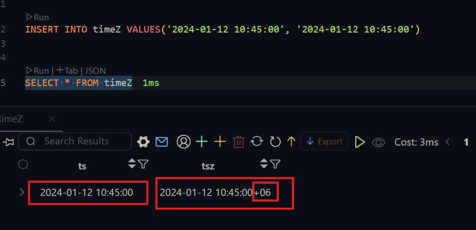
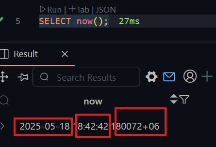
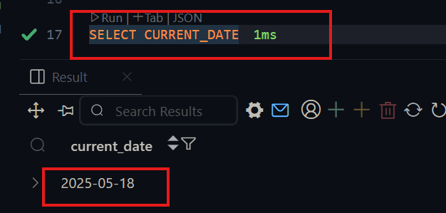
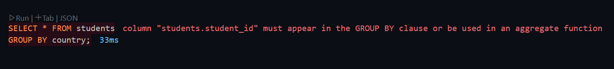
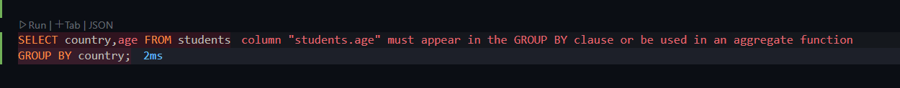
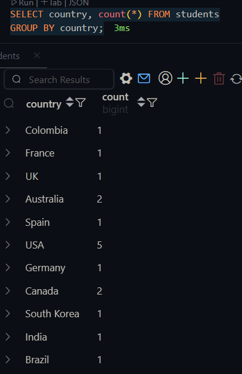
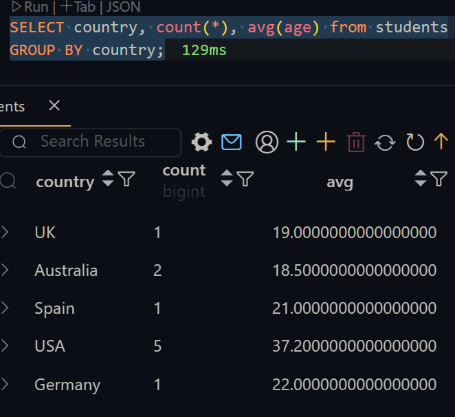

# Managing-Dates-Relationships-Ans-Understanding-Join-In-PostgreSQL

GitHub Link: https://github.com/Apollo-Level2-Web-Dev/dbms-postgres

## 9-1 Handling Date and Date Functions in PostgreSQL

#### `Timezone`

- we can see our timezone

```sql
SHOW timezone
```

#### `Timestamp`

- Timestamp means combination of date,time and time zone.

- timestamp is two type

  1. timestamp with timezone

  2. timestamp without timezone

```sql

  CREATE TABLE timeZ(
  ts TIMESTAMP without time zone,
  tsz TIMESTAMP with time zone
  )

  INSERT INTO timeZ VALUES('2024-01-12 10:45:00', '2024-01-12 10:45:00')

  SELECT * FROM timeZ
```



```sql
SELECT now();
```



- `SELECT now()` Gives us gives us timestamp with time zone.

- now we want to see just `date`

```sql
SELECT CURRENT_DATE
```



- we can also see just the date using `SELECT now()`

```sql
SELECT now()::date;
```

- this is called casting.
- we can also do the casting with time as well and just see the time

```sql
SELECT now()::time;
```

#### converting timestamp format using `to_char(timestamp,text)`

- This takes timestamp and converts to a required text mentioned

```sql
SELECT to_char(now(), 'yyyy/mm/dd')
```

```sql
SELECT to_char(now(), 'dd/yyyy/mm');
SELECT to_char(now(), 'month');
SELECT to_char(now(), 'dd');
```

https://www.postgresql.org/docs/current/functions-formatting.html

- we can format any type following the documentation

#### `Interval` with dates

- we want to see the date of last year from todays date

```sql
SELECT CURRENT_DATE - INTERVAL '1 year'
```

- we see 1 month previous date from todays date

```sql
SELECT CURRENT_DATE - INTERVAL '1 month'
```

- we can play more around

```sql
SELECT CURRENT_DATE - INTERVAL '1 year 2 month'
```

#### `age()` with dates

- suppose we have date now we want to calculate the age using `age()`.

```sql
SELECT age(CURRENT_DATE,'1997-07-02')
```

- If we have date of birth we can easily find the age

```sql
SELECT * , age(CURRENT_DATE,dob) from students;
```

#### `Extract()` function usage

- using this we can extract month, day year etc from a date

```sql
SELECT extract(year from '2025-01-25'::date);
SELECT extract(month from '2025-01-25'::date);
SELECT extract(day from '2025-01-25'::date);
```

- ::date Convert the value on the left (in this case, the string '2025-01-25') into the date data type.

#### Lets discuss about `casting`

- sone using `::`

```sql
SELECT '0' :: BOOLEAN
```

- its similar like type casting like nwe are telling `0` will be boolean type. the casting must be logical.

## 9-2 Grouping and Filtering Data with GROUP BY and HAVING

#### `GROUP BY` Usage

- `aggregate` function is used basically with `group by` clause
- `group by` dose something like we have a lot of data and now we want to do grouping country wise. iF we want to do group by using blood group we can do this.

```sql
SELECT * FROM students
GROUP BY country;
```



- this is showing error because we are telling to show all the rows using `*`
- so the proper way of grouping is

```sql

SELECT country FROM students
GROUP BY country;
```


```sql
SELECT country,age FROM students
GROUP BY country;
```



- This also shows the error, since age must be in group by or we have to use aggregate function.
- this is happening age is not relevant to the country groups , does not understand whose age should be shown,

- if we want to see how many students are in each country we acn see that.

```sql
SELECT country, count(*) FROM students
GROUP BY country;
```



- here `count(*)` is acting differently. rather than counting all the students together its counting each grouped countries students and showing.

- this happening because group by works in split,apply and combine procedure when we use `aggregate ` function with `group by`.


- now lets see country wise students average age with the country wise student count.

```sql
SELECT country, count(*), avg(age) from students
GROUP BY country;
```



#### `HAVING` Usage

- using `having` we can filter data made by `group by`
- lets think of like we have grouped using country and saw the average age based on the students of each country, now we want to set a condition like which group has average age greater than 22 show me. `filter groups using having to show only countries with average age above 22`

```sql
SELECT country, avg(age) FROM  students
GROUP BY country
HAVING avg(age) > 22;
```

- here `where` Condition will not workout since where works row by row.
- Lets solve this `Count Students Born In Each Year`

```sql
SELECT extract(year from dob) as birth_year, count(*)
FROM students
GROUP BY birth_year;
```

## 9-3 Constructing Relationships with Foreign Key Constraints

- `Foreign Key` Is Important to make relationship between different tables.


- `primary key` is used to identifying a data uniquely
- `Foreign Key` also uniquely identify a row uniquely but other table from where it came.


- we are defining `user_id INTEGER REFERENCES user(id)`.

- now tels do something like `retrieve all posts for user with id 4`

```sql
SELECT * FROM Post
where user_id = 4;
```

- this is ok but we want to see the `title` of post table and the `username` which is in user table.

- lets create the tables

```sql
CREATE TABLE "user" (
    id serial PRIMARY KEY,
    username VARCHAR(25) NOT NULL
)

CREATE TABLE post (
    id serial PRIMARY KEY,
    title TEXT NOT NULL,
    user_id INTEGER REFERENCES "user" (id) NOT Null
)

```

## 9-4 Enforcing Referential Integrity: Behaviors During Data Insertion

- lets see the data we have inserted

```sql

-- Insert users
INSERT INTO "user" (username) VALUES
('alice'),
('bob'),
('charlie'),
('diana');

-- Insert posts
INSERT INTO
    post (title, user_id)
VALUES ('Alice first post', 1),
    ('Bob travel blog', 2),
    ('Charlie on coding', 3),
    ('Alice second post', 1),
    ('Diana book review', 4),
    (
        'Another tech tip from Bob',
        2
    );

SELECT * from "user";
SELECT * from post;
```

- during the insert of data who has dependency with foreign key, we have to make sure that the foreign key should exist in where it is coming from. I we do not do there will be no data integrity. validation is done so this will show error.

#### During the insertion there can be many cases.

1. attempting to insert a post with a user id that does not exist. this will show error of foreign key violation

```sql
INSERT INTO post (title, user_id) VALUES
('Alice  first post', 100)
```

2. Inserting a post with a valid user id

```sql
INSERT INTO post (title, user_id) VALUES
('Alice  first post', 1)
```

3. Attempting to insert a post without specifying a user id.

```sql
INSERT INTO post (title, user_id) VALUES
('Alice  first post', null)
```

- this is not a good thing, we have to prevent this using constrain `not null`

```sql
ALTER table post
alter column user_id set NOT Null;
```

#### Lets See the behavior while deleting foreign key related table.

- suppose we want to delete the user but the post is having the deleted users user id. this is happening data inconsistency and data integrity is not maintained.
- these default behavior we can control if we want. like if we delete a user the post of the user will be also deleted. or we can say something like if the user is deleted the post's user id will become null. or we can do something like if user is deleted we can set default value to the post user_id. or we can say something like the posts should be deleted before the deletion of the user.
